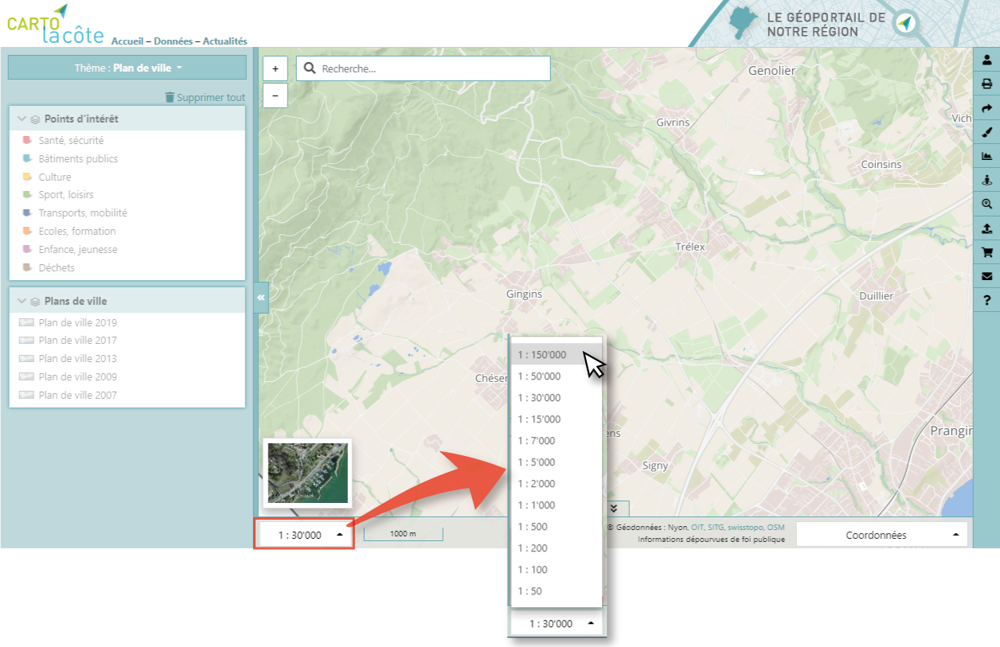
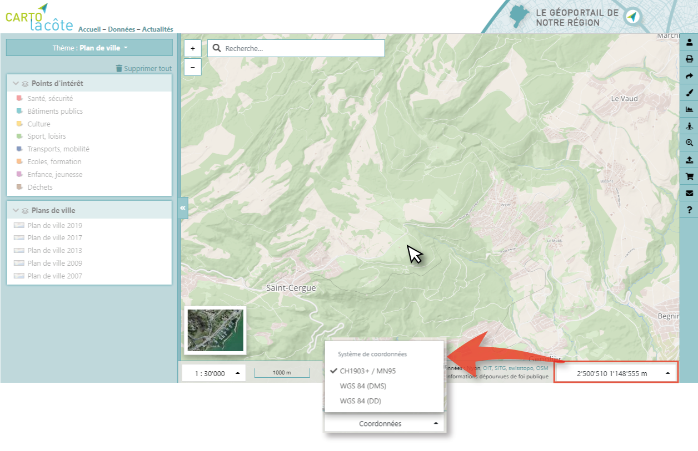
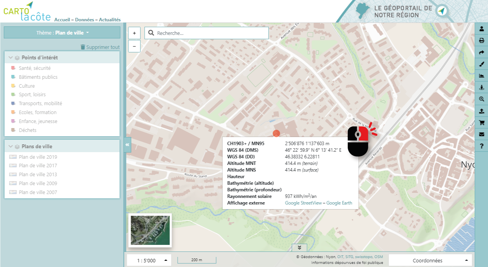

Navigation
==========

Déplacement
-----------

Le déplacement dans la carte se fait à l’aide de la souris avec le "drag and drop"

.. raw:: html

    
<video width="600" controls><source src="_static/deplacement_carte.mp4" type="video/mp4"></video>

Zoom
----

Le zoom dans la carte peut se faire de plusieurs façons :

* À l’aide de la souris
* À l’aide des boutons en haut à gauche de la carte
* À l’aide du clavier et de la souris
* À l’aide du sélecteur d’échelle en bas à gauche de l’interface

À l’aide de la souris
*********************

* Avec la roulette
* Avec un double clic
  
.. raw:: html

    
<video width="600" controls><source src="_static/zoom_double_clic.mp4" type="video/mp4"></video>

  
À l’aide des boutons en haut à gauche de la carte
*************************************************

.. raw:: html

    
<video width="600" controls><source src="_static/zoom_bouton.mp4" type="video/mp4"></video>

À l’aide du clavier et de la souris
***********************************

* En dessinant un rectangle avec la touche SHIFT enfoncée

.. raw:: html

    
<video width="600" controls><source src="_static/zoom_shift_selection.mp4" type="video/mp4"></video>

 
À l’aide du sélecteur d’échelle en bas à gauche de l’interface
**************************************************************

Coordonnées
-----------

Les coordonnées (choix du système de coordonnées avec la liste déroulante) du curseur sont
indiquées danns le pied de page, en bas à droite :

Un clic droit sur la carte permet d’obtenir les coordonnées et l’altitude du point :

Il est également possible d’afficher cet endroit dans Google Street View ou Google Earth, pour
autant que des données existent.

