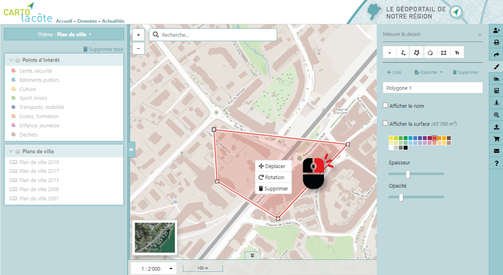

Outils
======

Les outils sont regroupés sur la barre verticale à droite de l’interface.

Mesure & Dessin
---------------

Des outils de mesure et de dessin permettent d’effectuer des annotations et mesures sur la
carte.

==========================  ====================  ==========================  =====================
Icône                       Action                Icône                       Action
==========================  ====================  ==========================  =====================
.. image:: _static/i10.png  Dessiner un point     .. image:: _static/i13.png  Dessiner un cercle
.. image:: _static/i11.png  Dessiner une ligne    .. image:: _static/i14.png  Dessiner un rectangle
.. image:: _static/i12.png  Dessiner un polygone  .. image:: _static/i15.png  Ecrire un texte
==========================  ====================  ==========================  =====================

Un double clic permet de terminer la saisie d’une ligne ou d’un polygone. Certaines propriétés
des objets dessinés peuvent être définies, telles que la couleur, l’épaisseur ou l’opacité.

L’affichage d’une information géométrique (coordonnées, longueur, surface, azimut)
complète les annotations et fait office d’outil de mesure.

Le clic droit sur un objet dessiné permet de le déplacer, le tourner ou le supprimer alors qu’un
clic droit sur un sommet permet de le supprimer.

Il est également possible de nommer les annotations et de les exporter aux formats KML et/ou
GPX.

Profil altimétrique
-------------------

Il est possible de tracer un profil en long en se basant sur les modèles numériques de terrain
et de surface (MNT et MNS).

.. raw:: html

    
<video width="600" controls><source src="_static/outils_profil.mp4" type="video/mp4"></video>

Après avoir activé l’outil de profil, il faut dessiner sur la carte le profil désiré et terminer avec
un double clic. Le profil, qui est interactif avec la carte, s’affiche ensuite à l’écran, avec en brun
le terrain et en vert les éléments de surface (bâtiments, végétation, etc.).

Street View
-----------

Pour activer l’affichage Street View, une fois l’outil sélectionné, il faut cliquer sur la carte pour
charger la vue 3D. La carte est synchronisée avec la vue 3D et vice-versa.

.. raw:: html

    
<video width="600" controls><source src="_static/street_view.mp4" type="video/mp4"></video>

Données externes
----------------

Il est possible d’ajouter différentes données externes à la carte :

* Géoservices (WMS ou WMTS)

* Fichier local (KML ou GPX)

Certains serveurs WMS (confédération, canton) sont préconfigurés (liste accessible en tapant
la lettre « h ») mais il est tout à fait possible de se connecter à d’autres serveurs WMS, en
entrant leur adresse dans le formulaire.

.. raw:: html

    
<video width="600" controls><source src="_static/donnees_externes.mp4" type="video/mp4"></video>

Statistiques
------------

Un outil de statistiques, accessible uniquement en étant connecté, permet de calculer des
statistiques sur la population, les emplois, les logements et l’énergie sur un secteur spécifique.

Pour effectuer un calcul, après avoir activé l’outil, il faut dessiner sur la carte un périmètre et
terminer la saisie par un double clic. Les différentes valeurs vont ensuite être calculées et
affichées, pour autant que la surface ne soit pas trop petite ni trop grande.

.. raw:: html

    
<video width="600" controls><source src="_static/statistiques.mp4" type="video/mp4"></video>

Recentrer
---------

Il est possible de recentrer la carte selon l'étendue d'une commune du district. 

.. image:: _static/recentrer.png