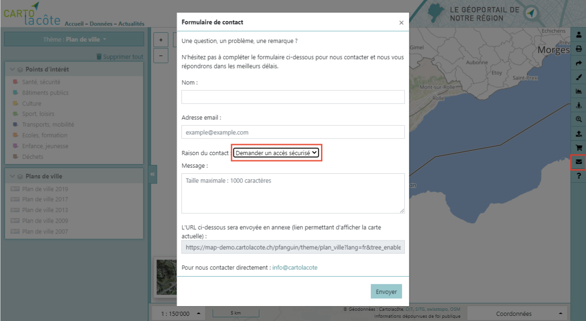
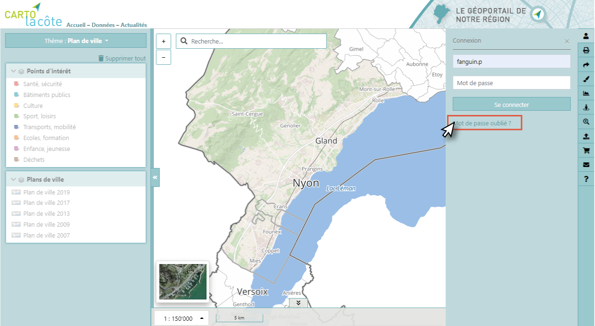

Connexion
=========

L’authentification permet à l’utilisateur d’accéder à des géodonnées supplémentaires. Selon le
profil de l’utilisateur, des données restreintes propres à son service sont également
accessibles.

Comme indiqué dans le formulaire de connexion, un accès sécurisé peut-être demandé en
utilisant le formulaire de contact.

En cas d’oubli de mot de passe, il est possible de le réinitialiser avec
le lien « mot de passe oublié » sous le formulaire de connexion :

