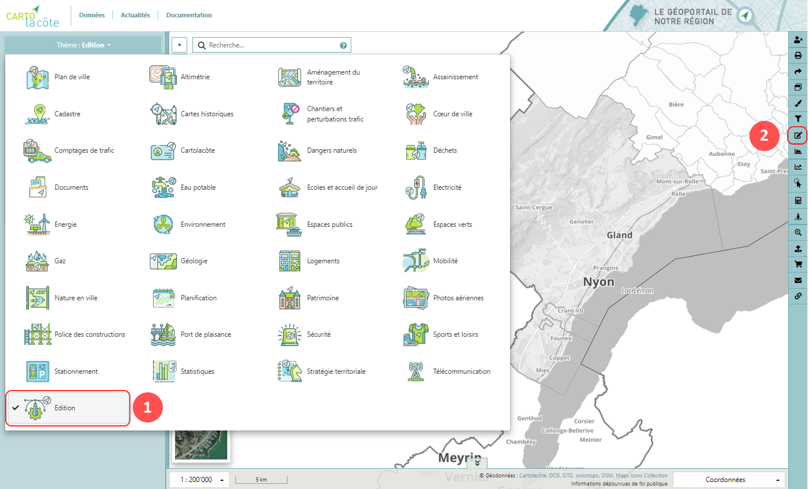

Édition
=======

Principes
---------

- Un outil d’édition, accessible uniquement en étant connecté, permet de mettre à jour certaines couches ;
- Ces couches éditables sont regroupées dans le dernier **thème « Édition »** [1]. Si celui-ci n’est pas visible, c’est que vous ne disposez pas des droits d’édition ;
- Après avoir cliqué sur le **bouton "Édition"** [2], vous avez la possibilité d'ajouter, d'éditer ou de supprimer un objet.

Ajouter un objet
----------------
1. Sélectionner la couche dans la liste déroulante

2. Cliquer sur dessiner un nouveau point / une nouvelle ligne / une nouvelle surface

3. Ajouter l’objet sur la carte (double clic pour terminer la saisie d’une ligne ou d’une surface)

4. Remplir les valeurs (les champs obligatoires sont marqués avec « * »)

5. Cliquer sur sauvegarder

Editer un objet
---------------
1. Sélectionner la couche dans la liste déroulante

2. Cliquer sur l’objet sur la carte

3. Modifier la géométrie de l'objet ligne ou surface ou déplacer l'objet point

4. Mettre à jour les valeurs (les champs obligatoires sont marqués avec « * »)

5. Cliquer sur sauvegarder

Supprimer un objet
------------------
1. Sélectionner la couche dans la liste déroulante

2. Cliquer sur l’objet sur la carte

3. Cliquer sur supprimer

