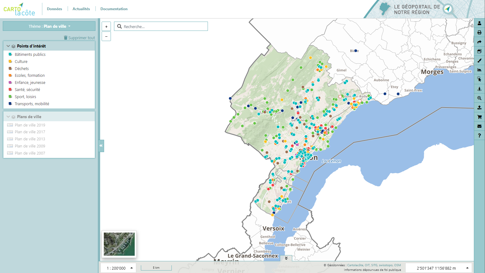

.. Cartolacôte documentation master file, created by
   sphinx-quickstart on Tue Jul 14 12:09:48 2020.
   You can adapt this file completely to your liking, but it should at least
   contain the root `toctree` directive.

Bienvenue sur la documentation du géoportail Cartolacôte!
=========================================================

.. toctree::
   :maxdepth: 1
   :caption: Documentation
   
   01_navigation
   02_donnees
   03_localisation_recherche
   04_interrogation
   05_outils
   06_impression_export
   07_connexion
   08_edition
   09_filtres
   10_version_mobile
   11_api
   12_iframe

.. toctree::
   :maxdepth: 1
   :caption: Historique de version

   historique_version/index